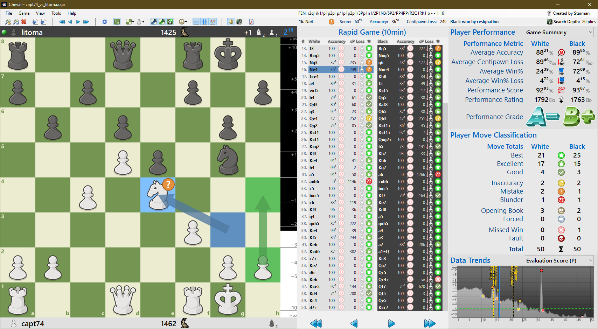

# Cheval

Cheval is a Windows application which analyzes chess games and provides derived data based on its analysis. Import a PGN file from any source with File > Import & Analyze PGN File. Note that game analysis can be a lengthy process, especially with a high Search Depth setting (in Tools > Engine Settings) and/or a lengthy chess game. 

Cheval relies on the Stockfish engine (version 17 or later) to operate. The full version of Cheval, including Stockfish 18, can be downloaded at https://cheval-chess.neocities.org/; the Stockfish engine itself can be downloaded at https://stockfishchess.org/download/. Specify the location of your Stockfish engine executable in Tools > Engine Settings.

An analyzed game can be saved to disk as as .cga (Cheval Game Analysis) file with File > Save Game Analysis, and such files can be loaded from disk with File > Open Game Analysis. The properly-formatted PGN representing the analyzed game can be exported to a separate .pgn file with File > Export PGN File.

The View menu provides options for customizing the interface, including: four piece styles; eight square styles; and highlighting for actual move played, best move, and move quality, for every position. Sound effects for moves played on the board can be toggled in the Tools menu, and a great deal of information about what you see in Cheval and how it performs calculations can be found in the Help menu.

After importing a PGN file for analysis or opening an existing analysis file from disk, use the arrow buttons in the Game menu (or below the move list) to move from position to position through the game. Click a move on the move list to jump directly to the position resulting from that move.

Customize and export a print-ready PDF file representing a game analysis as a report with Tools > Analysis Report. Cheval produces a multi-page report which starts with a summary page and continues with one or more pages with specific data about each move. Reports are formatted for US Letter, 8.5" x 11" (21.6cm x 27.9cm) and are ready to print. A typical report file requires about 0.5-1 MB of disk space.

Cheval, like Stockfish, is free software and may be freely redistributed under certain conditions; it falls under the General Public License, version 3 (GPLv3). See the included GPLv3.txt to read the license itself.

While Cheval is free software, please feel free to donate to Starman to show appreciation for his effort. You can find a donation link on Cheval's homepage, at https://cheval-chess.neocities.org/.
